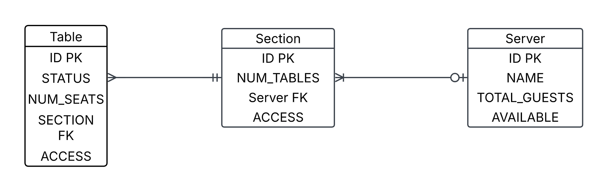

# Restaurant Seating Management System

This Web application is used to manage the seating logistics of a restaurant. It allows users to effecivley add tables and sections to a floor plan, assign servers to those sections, set tables to one of (open, check, or bus), and mangage reservations of varying sizes. 

By Ethan Catania

## *Project Requirements*
* README that describes the application and its functionalities
* ERD of your DB
* The application should be ASP.NET Core application
* The application should build and run
* The application should have unit tests and at least 20% coverage (at least 5 unit tests that tests 5 different methods/functionality of your code)
* The application should communicate via HTTP(s) (Must have POST, GET, DELETE)
* The application should be RESTful API
* The application should persist data to a SQL Server DB
* The application should communicate to DB via EF Core (Entity Framework Core)

## *Tech Stack*
* C# (Back End Programming Language)
* SQL Server (Azure Hosted)
* EF Core (ORM Tech)
* ASP.NET (Web API Framework)

## *Entity Relationship Diagram*

## *User Stories*
* Users should be able to add Tables to a floor plan
* Users should be able to Add Tables to Sections
* Users should be able to Assign Servers to Sections
* Users should be able to have Sections without Servers assigned
* Users should be able to change the status of any table
* Users should be able to remove Tables from the floor chart 
* Users should be able to removes Servers from the floor chart
* Users should be able to remove serctions fro m the floor Chart

 ## *MVP Goals*

* Customizable table chart
* Customizable Server assignment
* Customizable Server Sections
* Ability to change the status of any table 
* Ability to remove servers from the table chart
* Abiltiy to assign any table to any server

## *Stretch Goals*
* Ability to have customizable access criteria (booth, wheelchair accessibility, etc.)
* Ability to reserve multiple tables for the future
* Next table to seat recommendations

